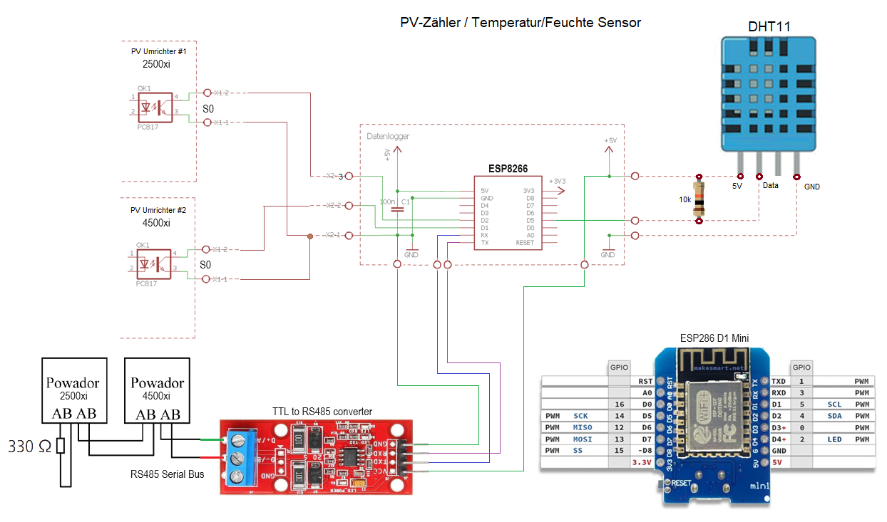
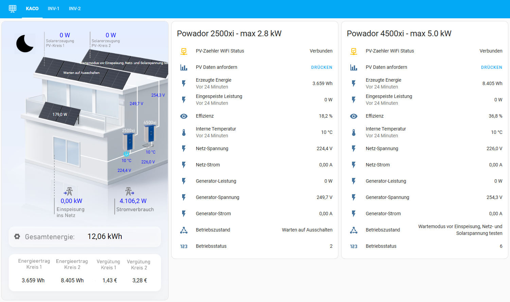
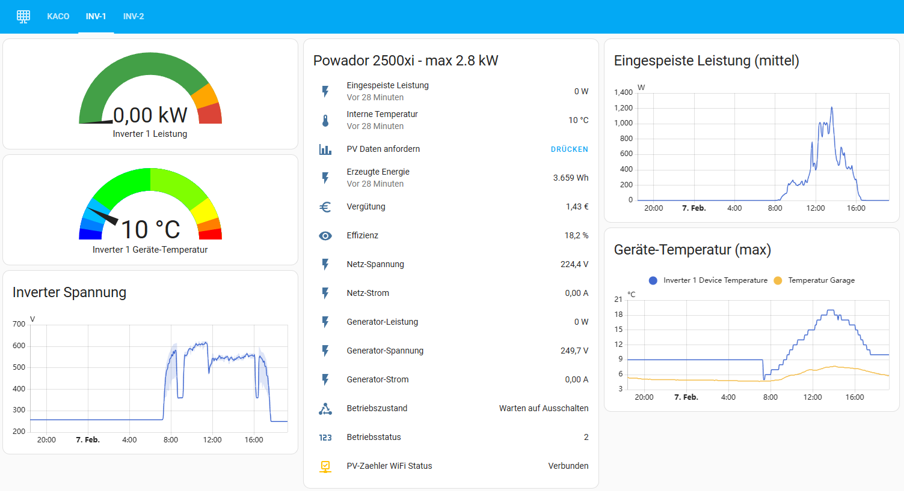
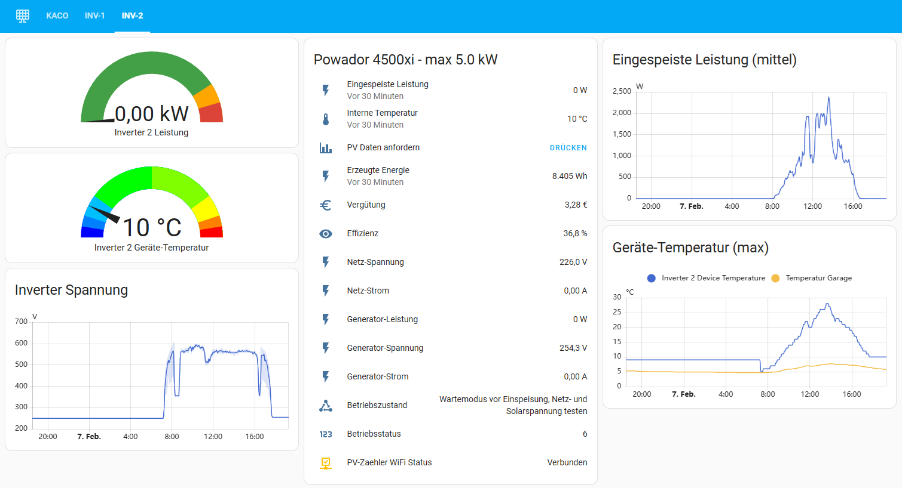
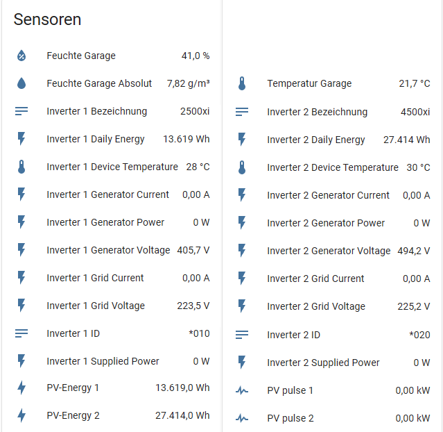
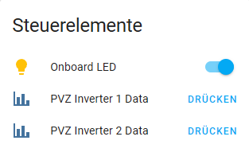
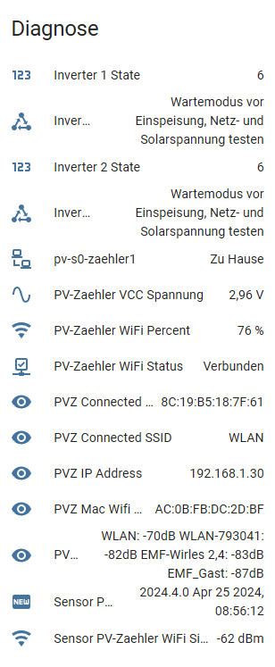
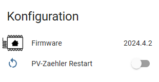

# HA-ESPHome-KACO-Powador-4500xi-S0-RS485
 
> **Home Assistant integration for KACO Powador solar inverters (2500xi & 4500xi) via an ESP8266 microcontroller using S0 pulse counting and RS485 serial communication.**
 
---
 
## Table of Contents
 
- [Overview](#overview)
- [Features](#features)
- [Supported Hardware](#supported-hardware)
- [Prerequisites](#prerequisites)
- [Repository Structure](#repository-structure)
- [Hardware Setup & Wiring](#hardware-setup--wiring)
  - [ESP8266 Pin Assignment](#esp8266-pin-assignment)
  - [Wiring Diagram](#wiring-diagram)
- [Communication Interfaces](#communication-interfaces)
  - [Interface 1 – S0 Pulse Counter](#interface-1--s0-pulse-counter)
  - [Interface 2 – RS485 Serial Bus](#interface-2--rs485-serial-bus)
- [Sensors & Data Points](#sensors--data-points)
  - [Inverter Sensors (per inverter)](#inverter-sensors-per-inverter)
  - [Environmental Sensor – DHT11](#environmental-sensor--dht11)
  - [Diagnostic Sensors](#diagnostic-sensors)
- [ESPHome Configuration](#esphome-configuration)
  - [Basic Device Setup](#basic-device-setup)
  - [UART / RS485 Configuration](#uart--rs485-configuration)
  - [S0 Pulse Meter Configuration](#s0-pulse-meter-configuration)
  - [Data Parsing Logic](#data-parsing-logic)
  - [Inverter State Codes](#inverter-state-codes)
  - [Polling Interval](#polling-interval)
  - [OTA Updates & Fallback Hotspot](#ota-updates--fallback-hotspot)
  - [API Service – Manual RS485 Write](#api-service--manual-rs485-write)
- [Home Assistant Integration](#home-assistant-integration)
  - [Dashboard Panels](#dashboard-panels)
- [Installation & Deployment](#installation--deployment)
- [Changelog](#changelog)
- [License & Disclaimer](#license--disclaimer)
 
---
 
## Overview
 
This project provides a complete **ESPHome-based data logger** that connects KACO Powador solar power inverters (models 2500xi and 4500xi) to **Home Assistant**. An **ESP8266** microcontroller serves as the bridge between the inverters and Home Assistant, collecting real-time data over two independent interfaces and exposing all values as native Home Assistant entities.
 
The integration supports **two inverters simultaneously** and exposes a rich set of measurements including power, voltage, current, temperature, daily energy yield, and inverter operating state — all available in Home Assistant for dashboards, automations, and energy monitoring.
 
---
 
## Features
 
- ✅ Supports **two KACO Powador inverters** (2500xi and 4500xi) in parallel
- ✅ **S0 pulse counting** interface for real-time grid feed-in power measurement
- ✅ **RS485 serial bus** readout for detailed inverter telemetry
- ✅ Automatic **60-second polling** of both inverters via RS485
- ✅ Parsed inverter response data: state, voltages, currents, power, temperature, energy
- ✅ Human-readable **inverter state text** (22 distinct state codes decoded)
- ✅ **DHT11 temperature & humidity sensor** for ambient monitoring (e.g., garage environment)
- ✅ Inverter **efficiency calculation** (supplied power / generator power)
- ✅ WiFi signal strength (dBm and percentage), IP address, MAC address diagnostics
- ✅ VCC supply voltage monitoring
- ✅ Manual RS485 write command via Home Assistant API service call
- ✅ Manual data request buttons for each inverter in Home Assistant
- ✅ ESP8266 **restart switch** from Home Assistant
- ✅ Pulse counter reset at midnight via SNTP time
- ✅ S0 outlier filtering with configurable clamp (min/max power range)
- ✅ WiFi fallback captive portal hotspot
- ✅ OTA (Over-The-Air) firmware updates
- ✅ Compatible with **ESPHome 2025** (no legacy Custom Components required)
 
---
 
## Supported Hardware
 
| Component | Details |
|---|---|
| Microcontroller | ESP8266 (e.g., ESP-01 with 1 MB flash, `esp01_1m` board) |
| Inverter Model 1 | KACO Powador 2500xi |
| Inverter Model 2 | KACO Powador 4500xi |
| S0 Interface | Open-collector pulse output (1000 pulses/kWh, configurable in inverter setup) |
| RS485 Interface | UART at 9600 baud, 8N1 |
| Environmental Sensor | DHT11 (temperature & relative humidity) |
 
---
 
## Prerequisites
 
- A running **Home Assistant** instance with the **ESPHome add-on** installed
- An **ESP8266** module (ESP-01 or compatible, at least 1 MB flash)
- A **TTL-to-RS485 adapter** (half-duplex, e.g., MAX485-based module) wired between the ESP8266 UART pins and the inverter RS485 bus
- **S0 pulse output wires** from each inverter connected to the ESP8266 GPIO inputs
- A **DHT11 sensor** (optional, for ambient temperature/humidity monitoring)
- Basic soldering / wiring skills and familiarity with ESPHome YAML configuration
 
---
 
## Repository Structure
 
```
HA-ESPHome-KACO-Powador-4500xi-S0-RS485/
├── esphome/                        # ESPHome configuration files
├── HA-Panel/                       # Home Assistant dashboard panel configurations
├── KACO/                           # KACO inverter related resources
├── Pictures/                       # Wiring diagrams and HA dashboard screenshots
│   ├── HA-KACO-Panel-0.png
│   ├── HA-KACO-Panel-1.png
│   ├── HA-KACO-Panel-2.png
│   ├── Inverter_ESP2866_Wirediagram_S0_RS485.png
│   ├── Pic1_Steuerelemente.png
│   ├── Pic2_Sensoren.png
│   ├── Pic3_Konfiguration.png
│   └── Pic4_Diagnose.png
├── PV-Zaehler_RS485_Config_GIT.yaml  # Main ESPHome YAML configuration
├── LICENSE
└── README.md
```
 
---
 
## Hardware Setup & Wiring
 
### ESP8266 Pin Assignment
 
| GPIO | NodeMCU Label | Function |
|---|---|---|
| GPIO1 | TX / TXD | RS485 UART TX (Hardware Serial) |
| GPIO3 | RX / RXD | RS485 UART RX (Hardware Serial) |
| GPIO2 | D4 | Onboard Blue LED (WiFi status indicator) |
| GPIO5 | D1 | S0 Pulse Counter – Inverter 1 |
| GPIO4 | D2 | S0 Pulse Counter – Inverter 2 |
| GPIO14 | D5 | DHT11 Temperature & Humidity Sensor |
| A0 (VCC) | – | VCC Supply Voltage Measurement |
 
> **Note:** Because GPIO1 (TX) and GPIO3 (RX) are used for RS485 communication, UART logging is disabled (`baud_rate: 0`) in the ESPHome logger to avoid conflicts.
 
### Wiring Diagram
 
The wiring diagram below shows how the ESP8266 connects to both KACO inverters via the S0 and RS485 interfaces:
 

 
Key wiring notes:
- The **S0 pulse outputs** of Inverter 1 and Inverter 2 connect to GPIO5 (D1) and GPIO4 (D2) respectively. Both pins are configured with internal pull-ups (`INPUT_PULLUP`).
- The **RS485 bus** (A/B lines) of both inverters shares the same bus and connects to the TTL-to-RS485 adapter, which in turn connects to the ESP8266 TX (GPIO1) and RX (GPIO3) pins.
- The **DHT11 sensor** data pin connects to GPIO14 (D5) with internal pull-up enabled.
- Each inverter must be configured in its setup menu for **1000 S0 pulses per kWh**.
 
---
 
## Communication Interfaces
 
### Interface 1 – S0 Pulse Counter
 
The **S0 interface** is a standardized open-collector pulse output found on many energy meters and inverters. Each inverter generates a configurable number of pulses per kWh fed into the grid. This project assumes **1000 pulses per kWh** (configurable in the inverter setup menu).
 
The ESPHome `pulse_meter` platform counts the incoming pulses and converts them to power in kW using the formula:
 
```
Power [kW] = pulses/min × 0.06
```
 
(where `0.06` is the conversion factor for 1000 pulses/kWh)
 
Additional filtering is applied:
- **Outlier filter:** sliding window max filter over 7 samples
- **Timeout:** output is forced to `0.0 W` if no pulses are received for 5 minutes
- **Clamp filter:** values outside 0.00 – 5.50 kW are discarded (accommodates up to 5000xi model output + 10% headroom)
- **Internal filter:** 20 ms debounce to suppress contact noise
 
### Interface 2 – RS485 Serial Bus
 
The **RS485 interface** uses a text-based request/response protocol. The ESP8266 sends a query command to each inverter address every 60 seconds:
 
| Inverter | Command Sent (ASCII) | Command Bytes |
|---|---|---|
| Inverter 1 | `#010\r` | `0x23 0x30 0x31 0x30 0x0D` |
| Inverter 2 | `#020\r` | `0x23 0x30 0x32 0x30 0x0D` |
 
The inverter responds with a single line of space-separated values starting with `*010` or `*020` (matching the inverter address). The response is parsed using `sscanf` to extract all measurement values.
 
**UART Configuration:**
- Baud rate: 9600
- Data bits: 8
- Parity: None
- Stop bits: 1
- TX Pin: GPIO1
- RX Pin: GPIO3
- Line delimiter: `\n`
 
---
 
## Sensors & Data Points
 
### Inverter Sensors (per inverter)
 
The following sensors are exposed for **each of the two inverters** (replace `1` with `2` for Inverter 2):
 
| Sensor Name | Unit | Description |
|---|---|---|
| `Inverter 1 State` | – | Numeric state code from inverter |
| `Inverter 1 Zustand` | – | Human-readable state text (German) |
| `Inverter 1 ID` | – | Device identifier string from inverter |
| `Inverter 1 Bezeichnung` | – | Inverter device type name |
| `Inverter 1 Generator Voltage` | V | PV generator (DC) voltage |
| `Inverter 1 Generator Current` | A | PV generator (DC) current |
| `Inverter 1 Generator Power` | W | PV generator (DC) power |
| `Inverter 1 Grid Voltage` | V | AC grid voltage |
| `Inverter 1 Grid Current` | A | AC grid current |
| `Inverter 1 Supplied Power` | W | AC power fed into the grid |
| `Inverter 1 Device Temperature` | °C | Inverter device temperature |
| `Inverter 1 Daily Energy` | Wh | Daily energy yield reported by inverter |
| `Inverter 1 Efficiency` | % | Conversion efficiency (Supplied / Generator power) |
| `PV-Energy 1` | Wh | Daily energy (mirrors Inverter Daily Energy for HA energy dashboard) |
| `PV pulse 1` | kW | Real-time power from S0 pulse counter |
 
### Environmental Sensor – DHT11
 
| Sensor Name | Unit | Description |
|---|---|---|
| `Temperatur Garage` | °C | Ambient temperature near the inverters |
| `Feuchte Garage` | % | Relative ambient humidity |
| `Feuchte Garage Absolut` | g/m³ | Calculated absolute humidity |
 
The DHT11 is read every 60 seconds with a 2-sample sliding window average applied and NaN values filtered out.
 
### Diagnostic Sensors
 
| Sensor Name | Unit | Description |
|---|---|---|
| `PV-Zaehler WiFi Signal` | dBm | WiFi RSSI signal strength |
| `PV-Zaehler WiFi Percent` | % | WiFi signal as percentage |
| `PV-Zaehler VCC Spannung` | V | ESP8266 supply voltage |
| `PV-Zaehler WiFi Status` | on/off | WiFi connection status binary sensor |
| `PVZ IP Address` | – | Device IP address |
| `PVZ Connected SSID` | – | Connected WiFi SSID |
| `PVZ Connected BSSID` | – | Connected WiFi BSSID |
| `PVZ Mac Wifi Address` | – | WiFi MAC address |
| `Sensor PV-Zaehler ESPHome Version` | – | Running ESPHome firmware version |
 
---
 
## ESPHome Configuration
 
The main configuration file is `PV-Zaehler_RS485_Config_GIT.yaml`. Below are the key sections explained.
 
### Basic Device Setup
 
```yaml
esphome:
  name: pv-s0-zaehler1
  comment: "KACO Powador 2500ix 4500ix Inverter (S0 + RS485)"
  project:
    name: "ESP8266.KACO Powador Inverter"
    version: "1.0"
 
esp8266:
  board: esp01_1m
```
 
Before flashing, replace the following placeholders in the YAML file:
 
| Placeholder | Description |
|---|---|
| `YOURKEY` | Your Home Assistant API encryption key |
| `!secret wifi_ssid` | Your WiFi SSID (in `secrets.yaml`) |
| `!secret wifi_password` | Your WiFi password (in `secrets.yaml`) |
| `YOUR-AP-PASSWORD` | Password for the fallback hotspot |
| OTA password | Change the OTA password to a secure value |
 
### UART / RS485 Configuration
 
```yaml
uart:
  id: pvz_rs485_uart
  tx_pin: GPIO1
  rx_pin: GPIO3
  baud_rate: 9600
  data_bits: 8
  parity: NONE
  stop_bits: 1
```
 
The UART debug component is enabled with `dummy_receiver: true` and processes each received line (delimited by `\n`) via a lambda function that parses the inverter response.
 
### S0 Pulse Meter Configuration
 
```yaml
sensor:
  - platform: pulse_meter
    name: "PV pulse 1"
    pin:
      number: GPIO5
      mode: INPUT_PULLUP
    unit_of_measurement: "kW"
    internal_filter: 20ms
    filters:
      - max:
          window_size: 7
          send_every: 4
      - multiply: 0.06          # Convert pulses/min → kW (1000 imp/kWh)
      - timeout:
          timeout: 300s
          value: 0.0
      - clamp:
          min_value: 0.00
          max_value: 5.50
          ignore_out_of_range: true
```
 
### Data Parsing Logic
 
The RS485 response is parsed using a C++ lambda in ESPHome. The expected response format from the inverter is:
 
```
*010 <state> <genV> <genI> <genP> <gridV> <gridI> <suppP> <temp> <energy> <parity> <deviceName>
```
 
For example:
```
*010 5 412.3 5.12 2103 230.1 9.10 2091 38 9423 AB Powador4500xi
```
 
The lambda uses `sscanf` with buffer-overflow protection, validates that the response starts with `*`, and routes the parsed values to the correct set of sensors based on whether the response begins with `*010` (Inverter 1) or `*020` (Inverter 2).
 
### Inverter State Codes
 
The numeric state code from the inverter is decoded into human-readable text:
 
| Code | Meaning |
|---|---|
| 0 | Inverter just switched on |
| 1 | Waiting for start |
| 2 | Waiting for switch-off |
| 3 | Constant voltage regulator |
| 4 | MPP regulator – with continuous search |
| 5 | MPP regulator – without search movement |
| 6 | Pre-feed-in wait mode (verification) |
| 7 | Wait mode before self-test |
| 8 | Relay self-test |
| 10 | Over-temperature shutdown |
| 11 | Power limitation |
| 12 | Overload shutdown |
| 13 | Overvoltage shutdown |
| 14 | Grid disturbance (3-phase monitoring) |
| 15 | Transition to night shutdown |
| 18 | RCD Type B shutdown |
| 19 | Insulation resistance too low |
| 30 | Measurement transducer fault |
| 31 | RCD Type B module error |
| 32 | Self-test error |
| 33 | DC injection fault |
| 34 | Communication fault |
| other | Unknown state |
 
### Polling Interval
 
Both inverters are queried automatically every 60 seconds via an `interval` block. A semaphore binary sensor (`rs485_write`) prevents overlapping write operations. The sequence is:
 
1. Check that no RS485 write is in progress.
2. Send `#010\r` to Inverter 1 and wait 2 seconds.
3. Send `#020\r` to Inverter 2 and wait 2 seconds.
4. Release the semaphore.
 
### OTA Updates & Fallback Hotspot
 
OTA firmware updates are supported natively via ESPHome:
 
```yaml
ota:
  platform: esphome
  password: "<your-ota-password>"
```
 
If the ESP8266 cannot connect to the configured WiFi network, it automatically opens a fallback hotspot named `PV-S0-Zaehler1 Fallback Hotspot` with a captive portal, allowing reconfiguration via browser.
 
### API Service – Manual RS485 Write
 
A custom Home Assistant API service (`write_pv_rs485`) is registered, allowing you to send arbitrary RS485 commands to the inverters from Home Assistant automations or the developer tools:
 
```yaml
services:
  - service: write_pv_rs485
    variables:
      command_rs485: string
    then:
      # ... sends command_rs485 as bytes over UART
```
 
---
 
## Home Assistant Integration
 
Once the ESPHome firmware is flashed and the device is running, Home Assistant will auto-discover it via the ESPHome integration. All sensors, buttons, and switches are immediately available as entities.
 
### Dashboard Panels
 
The `HA-Panel/` folder contains example Lovelace dashboard configurations. The screenshots below show example panels:
 
**Main overview panel:**
 

 
**Inverter detail panels:**
 


 
**Sensor values panel:**
 

 
**Controls panel (restart, manual data request buttons):**
 

 
**Diagnostics panel:**
 

 
**Configuration panel:**
 

 
---
 
## Installation & Deployment
 
1. **Clone the repository:**
   ```bash
   git clone https://github.com/GernotAlthammer/HA-ESPHome-KACO-Powador-4500xi-S0-RS485.git
   ```
 
2. **Copy the YAML configuration** `PV-Zaehler_RS485_Config_GIT.yaml` to your ESPHome configuration directory (e.g., `/config/esphome/` in Home Assistant).
 
3. **Create or update `secrets.yaml`** with your WiFi credentials:
   ```yaml
   wifi_ssid: "YourWiFiSSID"
   wifi_password: "YourWiFiPassword"
   ```
 
4. **Update the YAML file** with your Home Assistant API encryption key and OTA password.
 
5. **Flash the firmware** via the ESPHome dashboard in Home Assistant (install via USB for first flash, OTA thereafter).
 
6. **Wire the hardware** according to the pin assignment and wiring diagram above.
 
7. **Configure the inverters:**
   - Set the S0 pulse rate to **1000 pulses/kWh** in each inverter's setup menu.
   - Ensure the RS485 addresses are set to **01** (Inverter 1) and **02** (Inverter 2).
 
8. **Add to Home Assistant:** The device will be auto-discovered. Accept the integration and assign the entities to your energy dashboard.
 
> **ESPHome 2025 Compatibility:** As of ESPHome 2025, Custom Components are no longer supported. This configuration has been updated accordingly — the legacy `uart_read_line_sensor.h` file is **no longer needed** and should not be copied to your ESPHome directory.
 
---
 
## License & Disclaimer
 
This project is a **personal hobby project** and is in no way affiliated with KACO new energy GmbH or any other company.
 
Licensed under the **MIT License** — see the [LICENSE](LICENSE) file for full details.
 
> THE SOFTWARE IS PROVIDED "AS IS", WITHOUT WARRANTY OF ANY KIND, EXPRESS OR IMPLIED, INCLUDING BUT NOT LIMITED TO THE WARRANTIES OF MERCHANTABILITY, FITNESS FOR A PARTICULAR PURPOSE AND NONINFRINGEMENT. IN NO EVENT SHALL THE AUTHORS OR COPYRIGHT HOLDERS BE LIABLE FOR ANY CLAIM, DAMAGES OR OTHER LIABILITY, WHETHER IN AN ACTION OF CONTRACT, TORT OR OTHERWISE, ARISING FROM, OUT OF OR IN CONNECTION WITH THE SOFTWARE OR THE USE OR OTHER DEALINGS IN THE SOFTWARE.
 
**Use at your own risk.** Working with inverters and electrical installations involves safety risks. Always follow applicable electrical safety regulations and consult a qualified electrician if in doubt.
 
---
 
*Last updated: 2025-01-18 — Repository: [GernotAlthammer/HA-ESPHome-KACO-Powador-4500xi-S0-RS485](https://github.com/GernotAlthammer/HA-ESPHome-KACO-Powador-4500xi-S0-RS485)*
